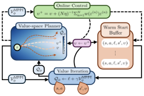

# soft-mpcritic

This is the codebase for our paper `Soft MPCritic: Amortized model predictive value iteration`

## Concept Diagram



*High-level overview of the Soft MPCritic architecture and training signal flow.*

## Requirements

- Python 3.10+
- [uv](https://docs.astral.sh/uv/getting-started/installation/)
- MuJoCo-compatible environment (for Gymnasium MuJoCo tasks)

## Setup

```bash
uv venv
uv sync
```

Run commands through `uv run` so they use the project environment.

## Quick Start

Inspect available flags:

```bash
uv run python soft_mpcritic.py --help
uv run python sac.py --help
```

Example single runs:

```bash
uv run python soft_mpcritic.py \
	--env-id Hopper-v5 \
	--track False \
	--total-timesteps 500000 \
	--horizon 4 \
	--target-horizon 4 \
	--num-rollouts 200

uv run python sac.py \
	--env-id Hopper-v5 \
	--track False \
	--total-timesteps 500000
```

## Experiment Scripts

The repository includes a launcher for sweeps and named experiment sets:

- `run_exp.py`

This script sets arguments in code and executes repeated runs over seeds/hyperparameters.

## Outputs

- Run artifacts are saved under `runs/`.
- W&B logs are used when `track=True`.
- Plotting scripts are under `plotting/`.

## Repository Layout Notes

- Legacy or experimental code that is not part of the main paper workflows is placed under `misc/`.

## Reproducibility Notes

- The repository uses `uv.lock` for pinned dependencies.
- Most scripts expose a `seed` argument.
- MuJoCo/Gymnasium versions can affect benchmark numbers; keep versions consistent with `pyproject.toml`.

## License

This project is licensed under the terms of the MIT License. See `LICENSE`.
